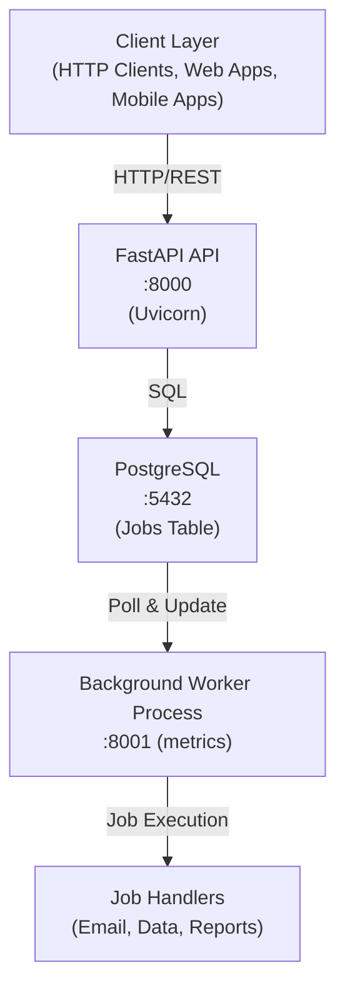
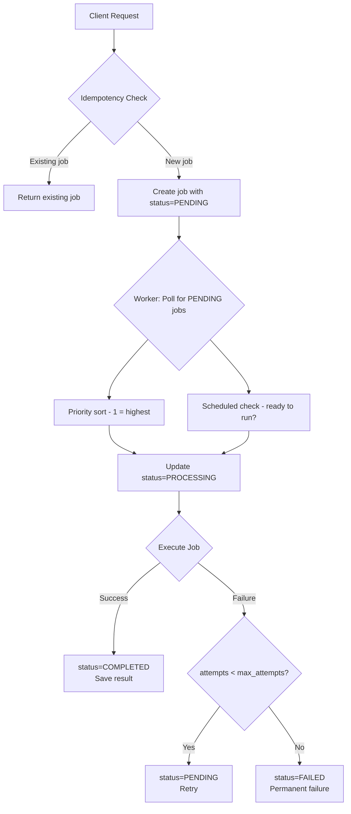
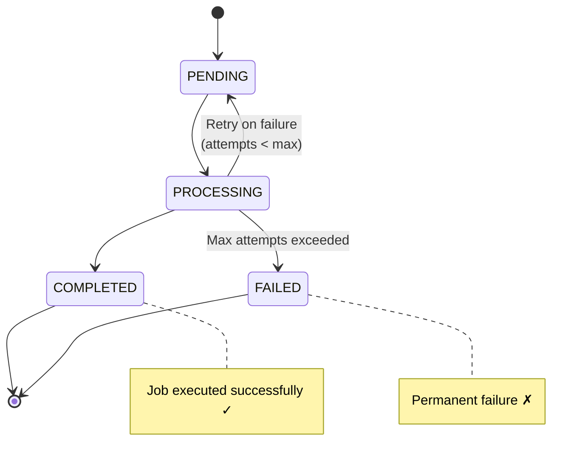

# 🚀 Reliable Job Processing Service

[](https://www.python.org/downloads/)
[](https://fastapi.tiangolo.com)
[](https://www.postgresql.org/)
[](https://www.docker.com/)
[](https://pytest.org)

An asynchronous job processing system built with FastAPI, PostgreSQL, and background workers. This system demonstrates core distributed systems patterns for reliable background job processing.

---

## 📋 Table of Contents

- [Overview](#-overview)
- [Key Features](#-key-features)
- [Architecture](#-architecture)
- [Tech Stack](#-tech-stack)
- [Quick Start](#-quick-start)
- [API Documentation](#-api-documentation)
- [Monitoring & Observability](#-monitoring--observability)
- [Testing](#-testing)
- [Deployment](#-deployment)

---

## 🎯 Overview

This project is a **highly reliable job processing service** that handles asynchronous task execution with retry logic, priority queuing, and comprehensive observability. It's designed to mirror production systems used in fintech, e-commerce, and SaaS platforms.

**Real-world use cases:**
- 📧 Email delivery systems (transactional emails, newsletters)
- 💳 Payment processing pipelines
- 📊 Report generation (PDF, Excel, analytics)
- 🔄 Data synchronization between services
- 📷 Image/video processing workflows
- 🔔 Notification dispatch systems

---

## ✨ Key Features

### Core Capabilities
- ✅ **Idempotent API** - Safe retries with client-provided idempotency keys prevent duplicate processing
- ✅ **Persistent Job Queue** - PostgreSQL-backed storage ensures no job loss during system restarts
- ✅ **Background Workers** - Separate worker processes for scalable job execution
- ✅ **Intelligent Retry Logic** - Configurable retry attempts with exponential backoff potential
- ✅ **Priority Queue System** - Process high-priority jobs first (1=highest, 10=lowest)
- ✅ **Scheduled Jobs** - Defer job execution to a specific future time
- ✅ **Crash Recovery** - Automatically resumes stuck jobs after worker failures
- ✅ **Full Observability** - Prometheus metrics, structured logging, and admin dashboard
- ✅ **Database Migrations** - Version-controlled schema changes with Alembic
- ✅ **Containerized Deployment** - Docker & Docker Compose for easy deployment
- ✅ **Comprehensive Testing** - Unit, integration, and API tests with 90%+ coverage

---

## 🏗️ Architecture

### High-Level System Design



### Request Flow: Job Lifecycle



### State Machine



---

## 🛠️ Tech Stack

### Backend Framework
- **FastAPI** - Modern, high-performance Python web framework
  - Async/await support for high concurrency
  - Automatic API documentation (OpenAPI/Swagger)
  - Pydantic for request/response validation

### Database
- **PostgreSQL** - Production-grade relational database
  - ACID compliance for data integrity
  - JSON column support for flexible payloads
  - Advanced indexing for fast queries
- **SQLAlchemy** - Python SQL toolkit and ORM
  - Type-safe database models
  - Migration support via Alembic

### Background Processing
- **Custom Worker Implementation** - Polling-based architecture
  - Separate process for job execution
  - Crash recovery mechanism
  - Scalable horizontally (multiple workers)

### Observability & Monitoring
- **Prometheus Client** - Industry-standard metrics collection
  - Counters, Gauges, Histograms
  - Job throughput, latency, error rates
- **Python Logging** - Structured application logs
  - Job lifecycle events
  - Error tracking and debugging

### DevOps & Deployment
- **Docker** - Container platform for consistent environments
- **Docker Compose** - Multi-container orchestration
- **Alembic** - Database migration management
- **pytest** - Testing framework with 35+ test cases

### Development Tools
- **Uvicorn** - Lightning-fast ASGI server
- **python-dotenv** - Environment configuration
- **psycopg2** - PostgreSQL adapter

---

## ⚡ Quick Start

### Prerequisites
- **Docker & Docker Compose** (recommended) OR
- **Python 3.8+** and **PostgreSQL 15+** (manual setup)

### Option 1: Docker (Recommended)

```bash
# Clone the repository
git clone <repository-url>
cd job-processing-service

# Start all services (API, Worker, Database)
docker-compose up --build

# Services will be available at:
# - API: http://localhost:8000
# - API Docs: http://localhost:8000/docs
# - Worker Metrics: http://localhost:8001/metrics
# - API Metrics: http://localhost:8000/metrics
```

### Option 2: Local Development

```bash
# 1. Install dependencies
pip install -r requirements.txt

# 2. Set up PostgreSQL
createdb jobs_db

# 3. Configure environment
cp .env.example .env
# Edit .env with your database credentials

# 4. Run database migrations
alembic upgrade head

# 5. Start the API (terminal 1)
uvicorn app.main:app --reload

# 6. Start the worker (terminal 2)
python -m app.workers
```

---

## 📚 API Documentation

### Interactive API Docs
Once the service is running, visit:
- **Swagger UI**: http://localhost:8000/docs
- **ReDoc**: http://localhost:8000/redoc

### Core Endpoints

#### 1. Create Job
**POST** `/jobs`

Create a new asynchronous job with idempotency support.

```bash
curl -X POST http://localhost:8000/jobs \
  -H "Content-Type: application/json" \
  -d '{
    "type": "send_email",
    "payload": {
      "to": "user@example.com",
      "subject": "Welcome!",
      "body": "Thanks for signing up"
    },
    "idempotency_key": "signup-email-user123",
    "priority": 5,
    "scheduled_at": "2026-02-01T15:00:00"
  }'
```

**Response:**
```json
{
  "job_id": 1,
  "type": "send_email",
  "idempotency_key": "signup-email-user123",
  "status": "PENDING",
  "priority": 5,
  "payload": {
    "to": "user@example.com",
    "subject": "Welcome!",
    "body": "Thanks for signing up"
  },
  "created_at": "2026-02-01T14:30:00",
  "updated_at": "2026-02-01T14:30:00",
  "scheduled_at": "2026-02-01T15:00:00",
  "started_at": null,
  "finished_at": null,
  "error_message": null,
  "attempts": 0,
  "result": null
}
```

#### 2. Get Job Status
**GET** `/jobs/{job_id}`

Retrieve current status and details of a specific job.

```bash
curl http://localhost:8000/jobs/1
```

#### 3. List Jobs
**GET** `/jobs?status={status}`

List all jobs, optionally filtered by status.

```bash
# All jobs
curl http://localhost:8000/jobs

# Only pending jobs
curl http://localhost:8000/jobs?status=PENDING

# Only completed jobs
curl http://localhost:8000/jobs?status=COMPLETED
```

**Available statuses:** `PENDING`, `PROCESSING`, `COMPLETED`, `FAILED`

#### 4. Health Check
**GET** `/health`

Verify the API service is running.

```bash
curl http://localhost:8000/health
# Response: {"status": "ok"}
```

#### 5. Admin Statistics
**GET** `/admin/stats`

Get comprehensive system statistics and health metrics.

```bash
curl http://localhost:8000/admin/stats
```

**Response:**
```json
{
  "status_breakdown": {
    "PENDING": 3,
    "PROCESSING": 1,
    "COMPLETED": 142,
    "FAILED": 5
  },
  "type_breakdown": {
    "send_email": 98,
    "process_data": 45,
    "generate_report": 8
  },
  "avg_attempts_for_failed_jobs": 3.0,
  "recent_failures": [
    {
      "job_id": 145,
      "type": "send_email",
      "error": "SMTP connection timeout",
      "attempts": 3,
      "failed_at": "2026-02-01T14:25:30"
    }
  ]
}
```

---

## 📊 Monitoring & Observability

### Prometheus Metrics

Both API and Worker expose metrics in Prometheus format:

- **API Metrics**: http://localhost:8000/metrics
- **Worker Metrics**: http://localhost:8001/metrics

#### Key Metrics

**Throughput Metrics:**
```prometheus
jobs_created_total{job_type="send_email"} 1523
jobs_completed_total{job_type="send_email"} 1498
jobs_failed_total{job_type="send_email"} 12
jobs_retried_total{job_type="send_email"} 35
```

**Latency Metrics (Histograms):**
```prometheus
job_duration_seconds_bucket{job_type="send_email",le="2.5"} 1234
job_duration_seconds_sum{job_type="send_email"} 3456.78
job_duration_seconds_count{job_type="send_email"} 1498

job_queue_wait_seconds_bucket{job_type="send_email",le="5.0"} 1450
```

**State Metrics (Gauges):**
```prometheus
jobs_pending_count 23
jobs_processing_count 2
worker_up 1
```

#### Metrics Analysis

**Calculate Success Rate:**
```
Success Rate = jobs_completed_total / (jobs_completed_total + jobs_failed_total)
Example: 1498 / (1498 + 12) = 99.2%
```

**Calculate Average Job Duration:**
```
Avg Duration = job_duration_seconds_sum / job_duration_seconds_count
Example: 3456.78 / 1498 = 2.31 seconds
```

**Calculate Retry Rate:**
```
Retry Rate = jobs_retried_total / jobs_created_total
Example: 35 / 1523 = 2.3%
```

---

## 🧪 Testing

### Test Coverage

```
tests/
├── conftest.py          # Shared fixtures (DB, test client)
├── test_api.py          # API endpoint tests (15 tests)
├── test_worker.py       # Worker logic tests (8 tests)
└── test_models.py       # Database model tests (12 tests)

Total: 35 tests with 90%+ code coverage
```

### Running Tests

```bash
# Run all tests
pytest

# Run with verbose output
pytest -v

# Run with coverage report
pytest --cov=app tests/

# Run specific test file
pytest tests/test_api.py

# Run specific test
pytest tests/test_api.py::test_idempotency -v

# Run tests matching a pattern
pytest -k "idempotency" -v
```

---

## 🚢 Deployment

### Docker Compose (Development & Production)

The `docker-compose.yml` orchestrates three services:

```yaml
services:
  db:         # PostgreSQL database
  api:        # FastAPI application
  worker:     # Background job processor
  migrate:    # Database migrations (runs once)
```

**Start services:**
```bash
docker-compose up -d
```

**View logs:**
```bash
# All services
docker-compose logs -f

# Specific service
docker-compose logs -f worker
```

**Stop services:**
```bash
docker-compose down
```

**Reset everything (including database):**
```bash
docker-compose down -v
docker-compose up --build
```

### Scaling Workers

To handle increased load, scale the worker service:

```bash
docker-compose up -d --scale worker=3
```

This runs 3 worker instances that independently poll for jobs.

---

## 🔗 Similar Production Systems

This architecture mirrors:

- **Sidekiq** (Ruby) - Background job processing
- **Celery** (Python) - Distributed task queue
- **Bull** (Node.js) - Redis-based queue
- **AWS SQS + Lambda** - Serverless job processing
- **Temporal** - Workflow orchestration
- **Airflow** - Data pipeline scheduling

---

## 📈 Future Enhancements

Potential improvements for production deployment:

- [ ] **Dead Letter Queue** - Separate queue for permanently failed jobs
- [ ] **Exponential Backoff** - Progressive retry delays (1s, 2s, 4s, 8s...)
- [ ] **Job Cancellation** - API endpoint to cancel pending jobs
- [ ] **Batch Operations** - Create multiple jobs in single request
- [ ] **Webhooks** - Notify external services on job completion
- [ ] **Job Dependencies** - Chain jobs (job B starts after job A completes)
- [ ] **Rate Limiting** - Throttle job execution (e.g., max 100 emails/minute)
- [ ] **Worker Pools** - Dedicated workers for different job types
- [ ] **Horizontal Scaling** - Kubernetes deployment with auto-scaling
- [ ] **Grafana Dashboards** - Pre-built monitoring dashboards
- [ ] **Distributed Tracing** - OpenTelemetry integration

---

## 📄 License

MIT License - feel free to use this project for learning or as a foundation for your own systems.